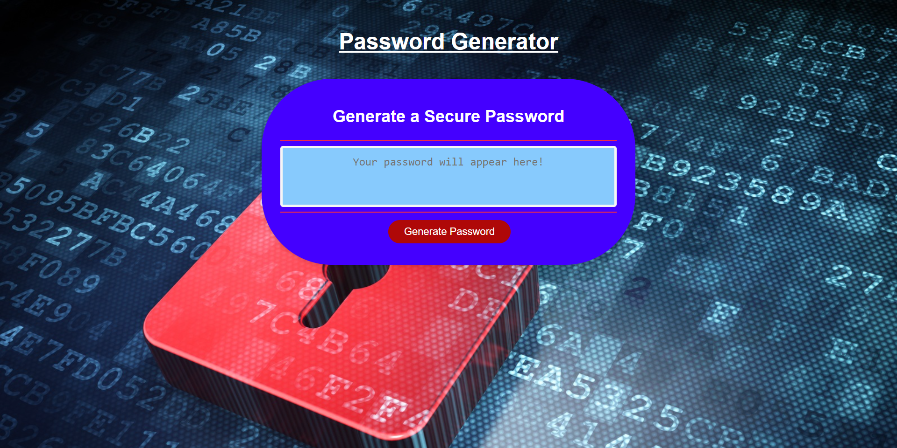

# Password Generator

## Description

This is a random, secure password generator. When one clicks 'Generate Password' the prompts are a little more informal than the norm, however they are meant to make the user smile! Enjoy!

## Change Log

*Update 1:
-Initial creation and deployment of the application to test functionality

*Update 2-6:
-Troubleshooting errors in the javascript code

*Update 7:
-Fixed errors in the code
-Changed styling within CSS
-Updated README

## What I learned

While working on this application, I learned again that research is a huge part of the developement process, along with testing and troubleshooting. Additionally, I learned the importance of keeping the code as simple as possible tto avoid headaches when testing/troubleshooting.

## Link

https://jplaisance41.github.io/Password-Generator/

## Screenshot

